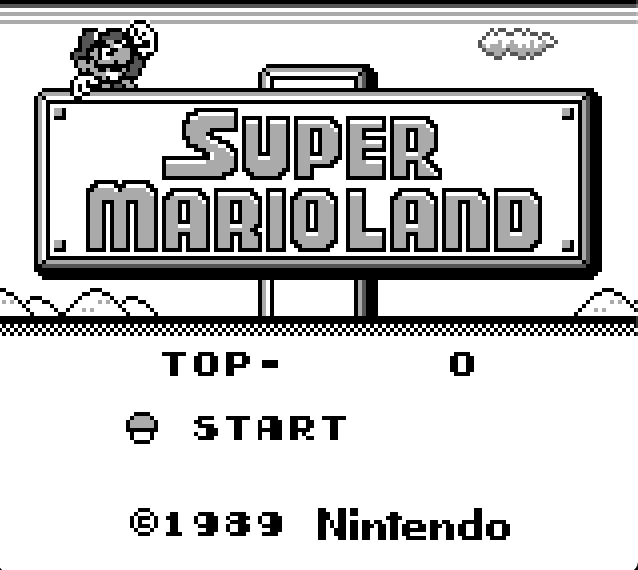

# Goboy

A Gameboy emulator written in Go. Follow progress [here](https://tmjohnson.co.uk/tags/goboy/).



Play in your browser [here](https://www.tmjohnson.co.uk/goboy/).

## Running

```sh
GO111MODULE=on go build -o goboy cmd/goboy/main.go
./goboy YOUR_ROM_HERE
```

If you have a BIOS/bootloader ROM you can get the scrolling Nintendo logo by specifying the ROM e.g.:

```sh
./goboy -bios bios.gb mario.gb
```

Builds coming soon.

Test with:
```sh
go test ./...
go run test_runner.go
```

I have tested with Tetris, Zelda, Kirby and Super Mario World. All work so far.

## TODO
- [ ] Audio needs implemented.
- [ ] There is some flickering I haven't had time to investigate yet.
- [x] Fix unit tests
- [ ] Implement MBC3 (for Pokemon).

## Buttons

|Gameboy|Keyboard|
|---|---|
|start|enter|
|select|backspace|
|up|up arrow|
|down|down arrow|
|left|left arrow|
|right|right arrow|
|A|Z|
|B|X|
